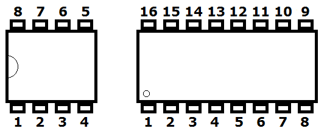
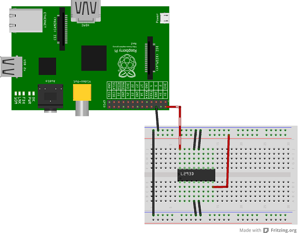
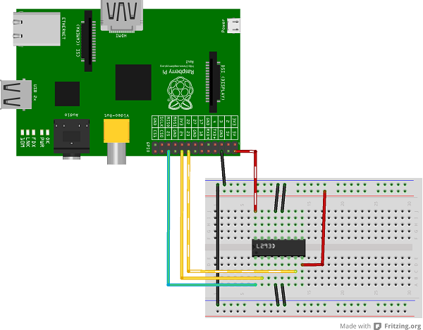
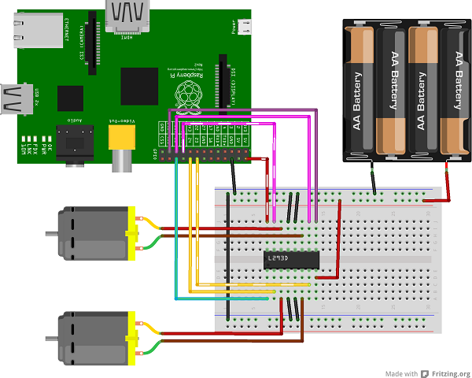

# L293D driver
*Python module to drive motors from a Raspberry Pi using the L293D chip*

## Contents:
1. [Installation](#installation)
2. [Hardware Setup](#hardware-setup)
3. [Python Scripts](#python-scripts)
4. [Test mode](#test-mode)
5. [Verbosity](#verbosity)
6. [License](#license)

## Installation

To install the Python library:

1. #### Clone code from GitHub
        $ git clone https://github.com/jamesevickery/l293d.git

2. #### Navigate to the l293d folder

        $ cd l293d/

3. #### Install the library:

        $ sudo apt-get install python-dev python-pip python-yaml
        $ sudo python setup.py install

4. #### Test

        $ python
        >>> import l293d.l293d as l293d

   If importing the library forces [test mode](#test-mode), try to install RPi.GPIO:

        $ sudo apt-get install RPi.GPIO

   This should only work on a Raspberry Pi, however other devices may be used to [test the functionality](#test-mode) of this library.

## Hardware Setup

You will need:
- Raspberry Pi
- L293D chip(s)
- Breadboard and wires
- DC motor(s)
- 4x AA power-pack (or similar)

1. #### Powering the L293D chip

   Power and ground setup:
   - The Pi's 5V → the l293d chip's pin 16 (see below image for numbering format)
   - An empty power rail → the l293d's pin 8
   - The Pi's ground (GND) → the ground rail(s)
   - Ground rail(s) → l293d chip's 4, 5, 12, and 13 pins (the middle ones)
   
   

   The circuit should look like this:

   
   
2. #### Data wires

   The GPIO pins used in this example can be substitued for other valid pins, as long as continuity is maintained when [setting up a Python script](#python-scripts).
   - GPIO 25 (pin 22) → L293D pin 1
   - GPIO 24 (pin 18) → L293D pin 2
   - GPIO 23 (pin 16) → L293D pin 7
   
   Your circuit should now look something like this:

   

3. #### Adding a motor

   - Motor wire 1 → L293D pin 3
   - Motor wire 2 → L293D pin 6
   
   

   You will also need to connect the battery pack to the power rail and the common ground rail - the one that connects to the L293D's pin 8.
   
   _Note: It doesn't matter which motor wire is connected to 3 or 6, although this will affect the direction. When you've set up a [Python script](#python-scripts), if `spin_clockwise` makes the motor spin anti-clockwise, the two motor wires should be swapped._

4. #### Adding another motor (optional)

   This is similar to how the first motor was connected, but the other side of the chip is used.
   
   - GPIO 11 (pin 23) → L293D pin 9
   - GPIO 9 (pin 21) → L293D pin 10
   - GPIO 10 (pin 19) → L293D pin 15
   
   - Motor wire 1 → L293D pin 11
   - Motor wire 2 → L293D pin 14
   
   

## Python Scripts

*to be added: how to create scripts with this library to set up and control motors*

## Test Mode

*to be added: what is test mode? what's it for? what is the meaning of life? etc.*

## Verbosity

*to be added: how to enable/disable verbosity, what it does and whatever*

## License

#### The MIT License (MIT)

*Copyright (c) 2016 James Vickery*

Permission is hereby granted, free of charge, to any person obtaining a copy of this software and associated documentation files (the "Software"), to deal in the Software without restriction, including without limitation the rights to use, copy, modify, merge, publish, distribute, sublicense, and/or sell copies of the Software, and to permit persons to whom the Software is furnished to do so, subject to the following conditions:

The above copyright notice and this permission notice shall be included in all copies or substantial portions of the Software.

THE SOFTWARE IS PROVIDED "AS IS", WITHOUT WARRANTY OF ANY KIND, EXPRESS OR IMPLIED, INCLUDING BUT NOT LIMITED TO THE WARRANTIES OF MERCHANTABILITY, FITNESS FOR A PARTICULAR PURPOSE AND NONINFRINGEMENT. IN NO EVENT SHALL THE AUTHORS OR COPYRIGHT HOLDERS BE LIABLE FOR ANY CLAIM, DAMAGES OR OTHER LIABILITY, WHETHER IN AN ACTION OF CONTRACT, TORT OR OTHERWISE, ARISING FROM, OUT OF OR IN CONNECTION WITH THE SOFTWARE OR THE USE OR OTHER DEALINGS IN THE SOFTWARE.
